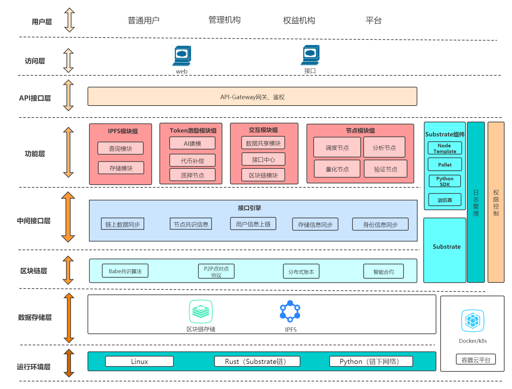
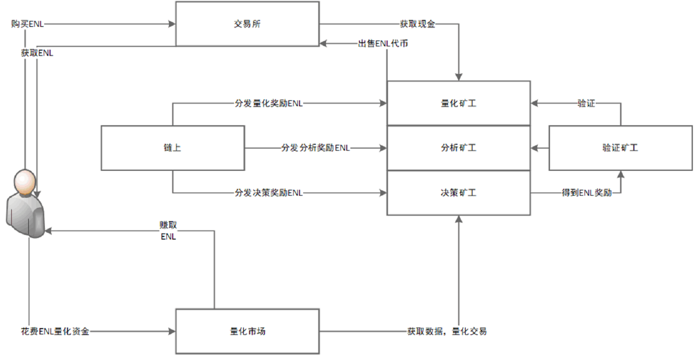

## **项目背景**

​	区块链自被创造以来，已经经过10余年的发展，如今在已经被广泛的应用于各行业领域。其比特币区块链网络存储的数据已达30G，而以太坊更是高达1TB的存储消耗。对于区块链而已，其并不是天然的适合处理高IO网络请求，或者具备强交互的业务场景。比如网络通信存在的延时，区块打包上链所需要的时间，大数据的存储等问题是当今区块链行业一直在面对且迫切值得解决的问题。而区块链上的数据并没有得到应有的利用与挖掘，区块链与生俱来的金融业务场景属性是现代金融迫切需要的点，DeFi的火爆不误其道理，传统行业例如银行，信托基金，借贷等行业受到DeFi的猛烈冲击。DeFi能够有效的解决传统金融的痛点。Uniswap开创性的解决了做市商的问题，人人都能够参与AMM，传统中心化交易所的利润，能够被无门槛的分享到提供流动性的参与者。Compound借贷平台，通过超额抵押代币获取流动性，有效的解决了加密货币在资金周转的问题。区块链在金融领域的业务场景逐步的被完善，其中的数据价值任然值得我们去探讨。据不完全统计Huobi，binance，Okex等交易所，每天所能够产生的交易数据数以亿计，且各大交易所之间存在的价差，在早期具备一定的套利空间，随着越来越多的套利者的参与，各大交易所的加密货币的价格最终稳定在一个合理的价格区间内。值得思考的是，区块链地址、交易转账等数据值得我们去分析与挖掘。而对于普通人员而言，其难以读懂且理解区块链数据背后所表达的含义，各地址见token的转移对整个加密市场的影响，都需要专业的数据分析师去分析匹配，对于区块链的数据分析，天然的有着极高的门槛。

## **Eternity labs 专注区块链数据分析的平台**

​	Eternity labs是基于substrate开发的区块链数据分析平台，其通过链下算法工作机、链下分析、链下预言机并结合IPFS分布式存储网络，解决了区块链链上处理数据性能差等问题。提出了双层网络节点架构设计的理念，即将整个区块链网络分为链上网络，链下网络。在保证了区块链网络安全的同时又兼顾了在处理数据时计算机高性能的处理能力，做到安全、高效、便捷同时又能够开箱即用，任何的人员能够通过这个网络轻松的了解到整个区块链网络存储数据其背后隐含的价值。

## **Off-chain algorithm worker 底层基础**

​	Off-chain algorithm worker节点高度抽象为模块化组件。整个链下共分为4种功能节点且具备可拓展性，分别为数据分析节点、量化节点、决策调度节点、验证节点。

- 数据分析节点。其功能负责处理整个区块链网络中的数据，并对数据处理后的结果进行签名广播，到其他节点当中。其能够实现对加密货币的基本面分析，分析地址个数、持仓情况，token代币价值预测等。

- 量化节点。其功能时负责接受用户资产的委托量化，实现二级市场套利，为用户提供一个稳定性的资产保值与增值服务。能够有效避免用户因为市场波动行情而做出了错误的决策判断。

- 决策调度节点。其功能负责动态分配用户委托订单，汇总全网数据分析、量化节点、验证节点的数据情况，并做出决策汇总。提高链下网络的利用率。

- 验证节点。其功能是对数据分析节点、量化节点、决策调度节点、验证节点进行历史数据回溯验证，确保整个网络具备更高的安全性，避免节点作恶。

## **Coral DSHT**

​	Coral协议是在2004年，由纽约大学的Michael Freedman、Eric Freudenthal和David Nazieres发明的一套内容分发网络系统（Content Delivery Network）。CDN的设计是为了避开互联网传输瓶颈，并且降低内容供应服务器的网络压力，使得内容能更快速、更稳定地传递给客户端。CDN的基本思想是在网络部署一些节点服务器，并且建立一套虚拟网络。网络中节点服务器之间实时更新连接信息、延时信息、用户距离参数等，然后将用户的请求重定向到最适合的节点服务器上。这样做有诸多好处，首先，通过节点服务器中转，用户访问网页的速度大大提高了；其次，节点服务器会缓存内容服务器的查询信息，那么也降低了内容服务器的网络负载；最后，内容服务器有可能出现暂时的离线，那么用户同样能通过节点服务器中的缓存读取。

​	Coral DSHT则是Coral CDN最核心的部件之一。Kademlia协议使用的是XOR距离，即信息永远是存储在XOR距离最近的节点中。而这并没有考虑实际网络的情况，例如节点之间的延时、数据的位置。这样会浪费大量网络带宽和存储空间。Coral解决了这个问题，不同于经典的DHT方式，Coral首先对所有的节点评估连接情况，然后根据循环时间（Round-Trip Time）划分为几个等级（Coral中是3层），L2(<20ms)、L1(<60ms)、L0（其他）。Coral还提供了两个操作接口，put和get，用于添加和查找一个键值对，以确定从哪一个等级的DSHT中查询。后面我们会详细描述它是如何实现的。

​	Coral DSHT（Distributed Sloppy hash table）适用于软状态的键值对检索，也就是同一个Key可能会保存多个Value。这种机制能把给定的Key映射到网络中的Coral服务器地址。比如，使用DSHT来查询距离用户较近的域名服务器；查询拥有特定网站缓存信息的服务器；定位周围的节点来最小化请求延时。

​	**1. 索引机制和分层**

​	Coral对路由表的处理也比较特殊，每一个Coral节点根据它们的延时特性放在不同的DSHT中。同一个DSHT的节点被称为一个集群（Cluster），每个集群有一个最大延时时间，称为集群直径（Diameter）。而整个系统会预先设定一个直径，称为等级（Level）。在每个等级划分下，每个节点都会是某一个DSHT的成员。一组节点只有满足两两直径小于第i个等级的极限时，它们才能成为一个集群。在Coral中，将DSHT分成了三层，Level-2对应两两延时小于20毫秒，Level-1对应两两延时小于60毫秒，Level-0对应其他的全部节点。Coral在询问时，也会优先请求等级更高、相应时间更短的节点。如果失败了，才会在下一级节点中请求。这样的设计不但降低了查询的延时，也更可能优先获得临近节点的返回数据。

​	**2. 基于键值对的路由层**

​	Coral的键值对与Kademlia一样，都是由SHA-1哈希计算得来的，有160bit。每个节点的ID是由它的IP地址通过SHA-1运算出来的。我们在此可以通过Put指令保存一个<Key, Value>对，用来表明Key和Value是接近的；也可以通过Get指令，来查询对于同一个Key，节点的远近顺序如何。具体的计算方法和路由方法与在2.1.1节中讲的Kademlia协议是一样的。

​	**3. Sloppy 存储**

​	在Kademlia协议中，数据会直接保存到XOR更近的节点。但实际情况是，如果某些数据非常热门，其他节点也会大量查询，会因此造成拥塞，我们称作Hot-Spot；同时，一个缓存键值对存储了过多的值，我们称其为Tree-saturation。Sloppy存储就是希望规避这两种情况发生。

​	每一个Coral节点定义有两种异常状态，Full和Loaded。Full状态定义为：在当前节点R，已经存在L个<Key, Value>对使得Key=k，并且这L个键值对的生存周期都大于新值的1/2。Loaded状态定义为：对于给定的Key=k，在过去的一分钟里已经收到超过特定次请求。

​	那么Coral在执行存储操作的时候分为两步进行。

​	第1步为前向查询，Coral会持续迭代查找距离Key更近的节点ID，这一点和Kademlia协议完全一样。每一个节点返回两个信息，其一，该节点是否加载，其二，对于该Key，这一节点存储有几个Value，每一个Value的实效时间是多长。客户端根据接收到的这些信息决定这些节点是否可以存储新的值。前向查询的过程会一直继续，直到客户端找到一个距离Key值最近的可连接节点。如果对某个节点查询异常，这一节点将不再继续迭代查询。可连接节点将被逐一压进堆栈里。

​	第2步为反向查询，客户端从第1步中得到了可以存放的节点列表。那么按照距离Key从近到远的顺序，依次尝试添加<Key, Value>对到这些节点。如果操作失败，比如在此时有其他节点也进行了插入，这一节点成为FULL状态，那么客户端将放弃存储这一节点，将其从堆栈内弹出，并尝试下一个节点，直到被成功存储

​	Coral DSHT协议来保证整个链下节点网络的安全可靠，数据分析节点、量化节点、决策调度节点、验证节点之间的通信通过Coral DSHT协议来确保节点之间通信高效等问题。我们仍然会考虑未来兼容多版本的链下网络通信协议来确保网络的安全。

## **OAW 协议栈**

​	Off-chain algorithm worker分布式的链下网络，OAW提供了支持部署和写入的平台，能够支持各功能代码的更新和版本管理。OAW协议负责6种不同功能的子协议，如下：

- 身份层：管理节点的生成和验证。

- 网络层：管理其他节点的链接，使用多种底层网络协议

- 路由层：以分布式哈希表（DHT）维护节点的路由信息以定位特定的对等节点和对象。响应本地和远端节点发出的查询请求。

- 策略层：管理各节点数据分析的结果，以及发送相关指令调度

- 功能层：以模块的形式提供量化、分析支持

- 文件层：负责管理OAW的代码文件，类似于git的版本化管理

## **ENL的项目价值**

​	随着就技术的进步，每天都有大量的区块链数据的产生，数据每年以几何级数增长。新一代区块链技术的应用，并定会促进新的世界格局。世界真正被数据化。数据分析对数据和算力的要求会是制约区块链在数据分析市场的瓶颈。ENL的诞生就是为了解决区块链的数据分析问题。希望借助ENL激励系统大幅度的降低节点的维护成本，同时提高数据存储的安全性收益。ENL的金融本质其实是共享经济，为全球提供更高效的存储设备和网络，降低数据分析建模和量化的成本带来了可能。

## **ENL经济系统**

​	ENLcoin经济体系设计是整个项目里重要的一环。经济体系的设计的健壮性直接决定了项目能否长期的运行。ENL为整个系统的流通代币，用户支付ENL token获取量化服务。而量化节点提供量化支持获取服务费。ENL项目代币恒定发行1亿枚

## **去中心化量化调度网络协议** 

​	Decentalized Quantitative Scheduling Network Protocol（DQSNP）主要负责各子协议节点的工作与实现。DQSNP在整个ENL链下网络起着管理、沟通作用，是ENL协议的协调中枢。提供了3各基本的操作：put、get和manage。用户、矿工在使用ENL的时候无需关注区块链的内部设计，只需要简单的调用3个  接口即可。

 

​	DQSNP是ENL链上生态板块负责调度的协议，因此其地位特别重要。DQSNP协议负责链接substrate网络，分配各分析节点的任务，调度量化节点，在整个offchain起着中央枢纽的作用。DQSNP即是ENL链下的大脑。

 

​	DQSNP的功能如下：

- 分配任务给数据分析节点，并统计各节点任务的执行情况。

- 接受链上用户委托的订单，如果是数据分析订单则将任务分配给随机3台空闲节点执行，并将结果返回。

- 接受链上用户委托的量化交易订单，并随机将任务分配给1台量化节点执行，并将结果返回。

- 统计收集各量化节点的盈亏情况

- 统计收集各量化节点的自己质押，量化资金情况

- 统计并发现各数据分析节点在线情况

- 统计并发现各验证节点在线情况

- 每1分钟更新一次全局状态

 

​	DQSNP为链下的中心调度节点，因此DQSNP也有着其独特的共识算法来维系整个网络。DQSNP节点由蜡烛拍卖产生，排名最靠前的100个节点具备参与调度的权利，并能够获得ENLtoken奖励。出于安全性的考虑，参与拍卖需要质押ENLtoken。同时为了更利于生态的发展，质押代币在第二轮拍卖后释放50%，后面质押的代币分为180天线性释放。挖矿产生的ENLtoken立即释放30%，剩余代币30天线性释放。整个过程在ink智能合约上完成。

## **亏损补偿**

在量化的过程中，难免产生亏损，在项目设计之中，绿色环保、项目的可持续发展是我们考虑的重要问题。与比特币、以太坊颇为不同的是，ENL并不采用Pow，Pos来作为挖矿产生。在第一阶段，substrate 共识算法采用DPoS，来确保节点控制在可以合理的范围内。再者，每一个区块产生的收益是不同的。ENL代币产生个数应当与项目真实的市值相关。因此每一笔收益可由验证节点、分析节点、量化节点、调度节点来分取合理的利润代币。ENL单词区块产生的个数由参与量化节点的用户产生负盈利来生产。用户得到的单个账户所获得的代币，经过加权平均后即为获得的补偿收益。而量化产生的盈利，其5%的利润~10%的利润由相关节点、和国库收取。这个我们举个例子，如果用户Jim量化了10000美金的资金，一年下来，平均得到了5000美金的收益年化率50%，那么他需要支付的服务费用，应当是250—500美金。而如果量化产生负利率，即10000美金，一年下来亏损了2000美金。则经过一段时间的全网区块确认后，他的量化账户导致能够得到ENL代币的补偿，显然对于长期持有ENL或者量化的用户来说，最终他的收益会变得非常可观。只要ENL不停的优化算法模型，就能够真正意义上的实现造血。

## **双层网络架构**

ENL架构设计为双层结构网络，分为substrate链上网络和链下offchain网络结构。链上网络采用DPoS算法，提高整个区块链网络吞吐量。Offchain链下网络采用DQSNP协议网络来调度分配，确保链下网络的安全可靠。

## **矿工收益结构**

​	在ENL经济体系当中，其各不同节点的收益是不同的。ENLcoin生态体系中矿工收益共有3收益。

- 新币发放的收益：DPoS矿工，通过产生区块获得ENLcoin系统的新币发放，该部分与EOS经济模型类似。

- 量化服务收益： 矿工通过提供相关的量化、分析、验证等服务得到交易的费用和新币的发放补贴。

- 量化市场收益：矿工通过在二级市场量化资金产生负利率得到ENL的奖励。

​	对于DPoS矿工来说收益单一，只能够得到substrate链上产生的区块收益。对于量化节点、和量化市场来说其能够得到的收益也多种多样，如果越来越多的人参与量化交易这个过程中来，那么其能够得到的收益也会成正比增长。由此，我们可以了解 ENLcoin经济体系中矿工收益的3部分来源。该经济体系在长期运行中通过各方利益进行自我修复，目的是打造一个更强健的分布式量化网络。

 

## **量化流程设计架构**

 

​	用户通过向智能合约存入量化资产后，调度节点同substrate检测整个具备量化资格的节点，并将其地址授权给合约地址，转账到相关地址中。量化节点在得到usdt后能将这笔token用于相关模型的盈利。最后通过风控来控制提币权限，且只能转账到原地址。最终智能合约根据盈亏的情况来分配资产到不同的用户账户当中。

